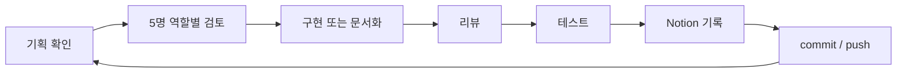

# Factory Pulse

Factory Pulse는 스마트 팩토리 운영자가 공장, 생산 라인, 설비, 알람, 리포트 상태를 빠르게 파악할 수 있도록 만든 **Next.js App Router + Supabase 기반 제조 운영 모니터링 애플리케이션**입니다.

단순 CRUD 화면이 아니라, 데이터 최신성에 맞춘 렌더링 전략, RLS 기반 보안, 실제 운영자가 확인해야 하는 KPI와 예외 상태를 중심으로 설계했습니다.

## 핵심 목표

- 공장/라인/설비 상태를 한 화면에서 빠르게 스캔할 수 있게 합니다.
- 알람과 센서 상태를 기준으로 현장 대응 우선순위를 판단할 수 있게 합니다.
- 리포트와 대시보드를 통해 생산량, 가동률, 품질 흐름을 확인합니다.
- 페이지별 데이터 성격에 맞춰 SSG, ISR, Dynamic Rendering, CSR, Streaming을 분리합니다.
- Supabase RLS 정책을 기준으로 공개 조회와 인증 필요 작업의 경계를 명확히 둡니다.

## 현재 구현 범위

| 영역 | 경로 | 렌더링 | 상태 |
| --- | --- | --- | --- |
| 홈 | `/` | SSG | 구현 완료 |
| 렌더링 문서 | `/docs/rendering` | SSG | 구현 완료 |
| 공장 목록 | `/factories` | ISR + CSR 필터 | 구현 완료 |
| 공장 상세 | `/factories/[factoryId]` | ISR | 구현 완료 |
| 설비 목록 | `/machines` | Dynamic + CSR 필터 | 구현 완료 |
| 설비 상세 | `/machines/[machineId]` | Dynamic | 구현 완료 |
| 알람 | `/alarms` | Dynamic + CSR 필터 | 구현 완료 |
| 리포트 | `/reports` | ISR + CSR 필터/차트 | 구현 완료 |
| 대시보드 | `/dashboard` | Dynamic + Streaming/Suspense | 구현 완료 |

## 기술 스택

| 구분 | 사용 기술 |
| --- | --- |
| Framework | Next.js 16 App Router, React 19 |
| Language | TypeScript |
| Styling | Tailwind CSS |
| Database/API | Supabase Postgres, Supabase JS |
| Data State | TanStack Query |
| Test | Jest, Playwright headed Chrome |
| Quality | ESLint, TypeScript type-check |

## 프로젝트 구조

```text
src/
  app/
    dashboard/
    factories/
    machines/
    alarms/
    reports/
    docs/rendering/
  lib/
    supabase/
    dashboard/
    factories/
    machines/
    alarms/
    reports/
tests/
  e2e/
.codex/
  agents/
```

## 환경 변수

`.env.local` 파일을 만들고 아래 값을 입력합니다.

```bash
NEXT_PUBLIC_SUPABASE_URL=https://프로젝트-ref.supabase.co
NEXT_PUBLIC_SUPABASE_ANON_KEY=Supabase publishable 또는 anon key
```

주의할 점:

- 브라우저에 노출되는 값은 `publishable key` 또는 legacy `anon key`만 사용합니다.
- `secret key`, `service_role key`, 데이터베이스 비밀번호는 절대 프론트엔드 환경 변수에 넣지 않습니다.
- `.env.local`은 `.gitignore`에 포함되어 커밋되지 않습니다.

## 실행 방법

의존성을 설치합니다.

```bash
npm install
```

개발 서버를 실행합니다.

```bash
npm run dev
```

Codex 검증용으로는 사용자 로컬 서버와 충돌하지 않도록 3001 포트를 사용합니다.

```bash
npm run dev -- --port 3001
```

## 검증 명령

```bash
npm run type-check
npm run lint
npm run test:unit
npm run test:e2e:chrome
npm run test:all
```

현재 기준 검증 상태:

| 검증 | 결과 |
| --- | --- |
| TypeScript type-check | 통과 |
| ESLint | 통과 |
| Jest unit test | 5개 suite / 14개 test 통과 |
| Playwright headed Chrome E2E | 8개 test 통과 |

## 루프엔지니어링 운영

Factory Pulse는 5명의 고정 역할 sub-agent를 기준으로 작업을 반복합니다.

| 역할 | 모델 | 책임 |
| --- | --- | --- |
| 총괄기획자 | GPT-5.5 high | 목표, 범위, 사용자 흐름, 완료 기준 정의 |
| 총괄디자이너 | GPT-5.5 medium | 정보 구조, 상태 표현, 액션 UI 기준 검토 |
| CTO(개발자) | GPT-5.5 high | 구현, Supabase, RLS, 렌더링 전략 검토 |
| 리뷰어 | GPT-5.5 medium | 누락 요구사항, 리스크, 회귀 가능성 점검 |
| 테스터 | GPT-5.5 high | QA 기준, 버튼별 테스트, 자동화 검증 관리 |

각 작업 루프는 보통 다음 흐름으로 진행합니다.



Notion에는 회의록, 결정 기록, Tasks, QA 증거를 남기고, Mermaid 블록은 항상 미리보기 형식으로 관리합니다.

## 다음 우선순위

1. 알람 확인/해결 Server Action과 권한 조건 구현
2. 설비 상세의 센서 이력 차트 고도화
3. 리포트 상세/비교 화면 추가
4. 대시보드 개인화 설정과 저장 정책 구현
5. Supabase Realtime 또는 Polling 기반 실시간 알람 갱신

## 커밋 원칙

- 기능, 테스트, 문서, 설정 변경을 가능한 한 분리해 커밋합니다.
- 작업 완료 후 `type-check`, `lint`, `unit`, headed Chrome E2E 중 필요한 검증을 실행합니다.
- 검증이 끝난 작업은 `commit` 후 원격 저장소에 `push`합니다.
